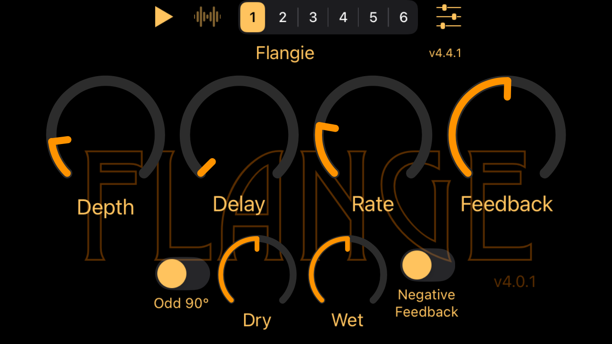
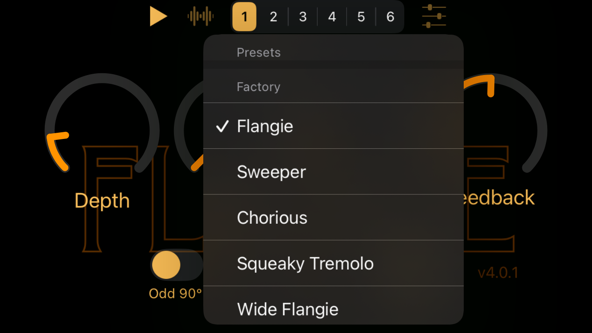
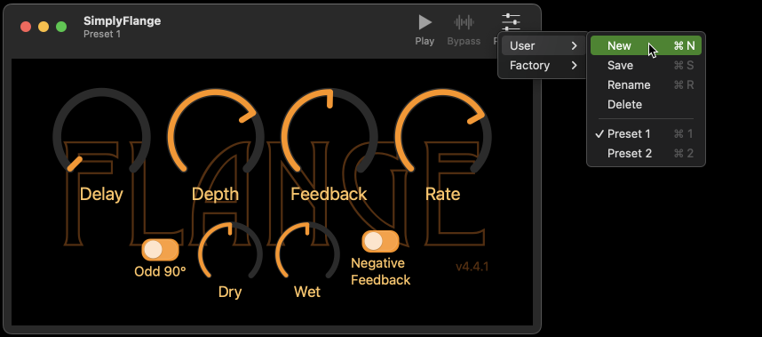

[](https://github.com/bradhowes/AUv3Template/actions/workflows/CI.yml)
[](https://swift.org)
[](https://developer.apple.com/documentation/audiounit)
[](https://opensource.org/licenses/MIT)


# About AUv3Template

This is full-featured AUv3 effect template for both iOS and macOS platforms. When configured, it will build an
app for each platform and embed in the app bundle an app extension containing the AUv3 component. The apps are designed
to load the AUv3 component the same way as a host such as GarageBand would. It uses the extension to demonstrate how it
works by playing a sample audio file and routing it through the effect and out to the device's speaker. The host
app also supports user and factory presets. User presets can be created, updated, renamed and deleted. Factory
presets can only be activated.

Additional features and info:

* Uses a C++ kernel to generate audio samples in the render thread
* Provides a *very* tiny Objective-C (Objective-C++ really) wrapper for access to the kernel from Swift code
* Uses Swift for all UI and all audio unit work not associated with sample rendering

## iOS Example

Here are images showing my [SimplyFlange](https://github.com/bradhowes/SimplyFlange) app running in the iPhone SE
simulator in landscape orientation. This app was based on [AUv3Template](https://github.com/bradhowes/AUv3Template) and
so uses the AUv3Support package.



The controls at the top come from the AUv3Support-iOS package as part of the host application infrastructure it
provides. There, you find:

- _play_ button to start/stop audio playing through the filter
- _bypass_ button to disable the filter
- _presets bar_ to quickly choose from a factory preset from the AUv3 extension
- _presets menu_ to show a menu of user and factory presets



The hosting app supports creating and managing user presets for the extension. These should operate in the same way that
they do in other hosting apps such as GarageBand, Logic, Cubasis, AUM. You can create your own presets. When a user
preset is active, you can then:

- _Update_ the preset by saving the current parameter settings under its name
- _Rename_ the preset to give it a new name
- _Delete_ the preset to remove it from the device

## macOS Example

Here is an image showing the macOS version of the same AUv3 plugin. This time the host controls are found in the app's
title bar.



# Swift 6

The code was originally developed in Xcode 12.4 on macOS 11.2.1 but the latest version now requires Swift 6. There are
currently no known concurrency warnings or errors in the code.

Apps from the templatey have tested on both macOS and iOS devices, primarily in GarageBand but also using test hosts on
both devices as well as the excellent [AUM](https://apps.apple.com/us/app/aum-audio-mixer/id1055636344) app on iOS.

Finally, it passes all
[auval](https://developer.apple.com/library/archive/documentation/MusicAudio/Conceptual/AudioUnitProgrammingGuide/AudioUnitDevelopmentFundamentals/AudioUnitDevelopmentFundamentals.html)
tests:

```bash
% auval -v aufx flng BRay
```

Here `flng` is the unique component subtype for my [SimplyFlange](https://github.com/bradhowes/SimplyFlange) effect and
`BRay` is my own manufacturer ID. You should use your own values that you put in
[Configuration/Common.xcconfig](Configuration/Common.xcconfig).

# Generating a New AUv3 Project

Note that this **is** a template, and as such it may not successfully run when compiled. The best bet is to use the
Python3 [build.py](scripts/build.py) script to create a new project from the template. To do so, fire up a terminal
shell and go into the _AUV3Template_ directory. The script takes two arguments:

- the name of the new project
- the 4-character _subtype_ of the effect

You would run it like this:

```bash
% python3 scripts/build.py MyEffect subtype
```

The name value should be self-evident in purpose: it will be the name of your iOS and macOS app, and the basis for the
name of your app extensions. The _subtype_ is a unique 4-character identifier for your new effect. It should be unique
at least for your manufacturer space (see [Configuration/Common.xcconfig](Configuration/Common.xcconfig)) so that it
will not conflict with another app extension.

With a project name called "MyEffect", the Python3 script will creates new folder called _MyEffect_ that is a sibling to
the _AUv3Template_ folder. The script will populate the new folder with the files from this template. Afterwards you
should have a buildable and working AUv3 effect embedded in a demo app for iOS and macOS. All files with `--NAME--` in
them will be replaced with the first argument given to `build.py` (e.g. "MyEffect"), and all text files will be changed
so that the strings `--NAME--` and `--SUBTYPE--` are replaced with their respective substitutions that you provided.

Note that to successfully compile you will need to edit [Configuration/Common.xcconfig](Configuration/Common.xcconfig)
and change the `DEVELOPMENT_TEAM` setting to hold your own Apple developer account ID so that Xcode can sign the
binaries it creates. You should also adjust other settings as well to properly identify you and/or your company. The
values to change should be clear.

> :warning: You are free to use the code according to [LICENSE.md](LICENSE.md), but you must not replicate
> someone's UI, icons, samples, or any other assets if you are going to distribute your effect on the App Store.

## fastlane

The new project will be configured to generate screenshots using [fastlane](https://github.com/fastlane/fastlane).
However, you will still need to *install* fastlane if you don't already have it. I've used:

```bash
% brew install fastlane
```

but there are other (better?) ways described in the [fastlane docs](https://docs.fastlane.tools).

# App Targets

The macOS and iOS apps are simple AUv3 hosts that demonstrate the functionality of the AUv3 component. In the
AUv3 world, an app serves as a delivery mechanism for an app extension like AUv3. When the app is installed, the
operating system will also install and register any app extensions found in the app.

The apps attempt to instantiate the AUv3 component and wire it up to an audio file player and the output
speaker. When it runs, you can play the sample file and manipulate the effects settings in the components UI.

# Code Layout

Each OS ([macOS](macOS) and [iOS](iOS)) has the same code layout:

* `App` -- code and configury for the application that hosts the AUv3 app extension
* `Extension` -- code and configury for the extension itself. It contains the OS-specific UI layout
  definitions.

All of the common code shared between the iOS and macOS apps and app extensions resides in the [Packages](Packages)
folder as Swift packages. Originally, this common code was built as a shared framework, but now Swift packages are
powerful enough to do the same. There are at present 5 separate libraries that are built in package form:

* [Kernel](Packages/Sources/Kernel) -- the C++ and Obj-C++ code dedicated to rendering audio samples for the AUv3 component
* [KernelBridge](Packages/Sources/KernelBridge) -- a small bridge to the Obj-C++ kernel for Swift
* [ParameterAddress](Packages/Sources/ParameterAddress) -- definitions of the runtime parameters that control the
operation of the kernel
* [Parameters](Packages/Sources/Parameters) -- collection of AUParameter entities based on the definitions from
the `ParameterAddress` library. Also provides factory presets for the audio unit.
* [Theme](Packages/Sources/Theme) -- lame attempt at sharing resources in a package. Unfortunately, right now it does not work well 
with Xcode. For instance, Xcode will not see/use fonts nor color sets that are recorded in this package. I do not know of a way to 
work around this issue other than to copy the resources to a folter outside of the package hierarchy and flag them as belonging to
both executables.

There are additional details in the individual `README` files in the above folders as well.

# Dependencies

This code now depends on two Swift packages:

- [AUv3Support](https://github.com/bradhowes/AUv3Support) -- common AUv3 component and host code. Much of the code that
was originally in a shared framework in this repo is now in this separate package.
- [Knob](https://github.com/bradhowes/knob) -- a simple library for macOS and iOS that generates rotary "knob" controls
